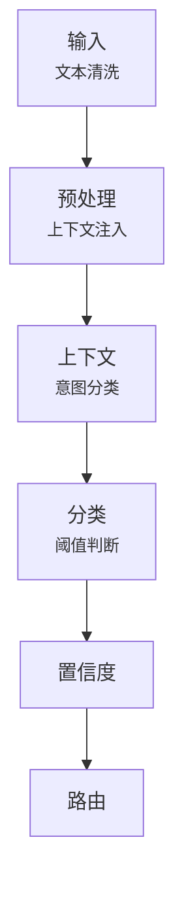
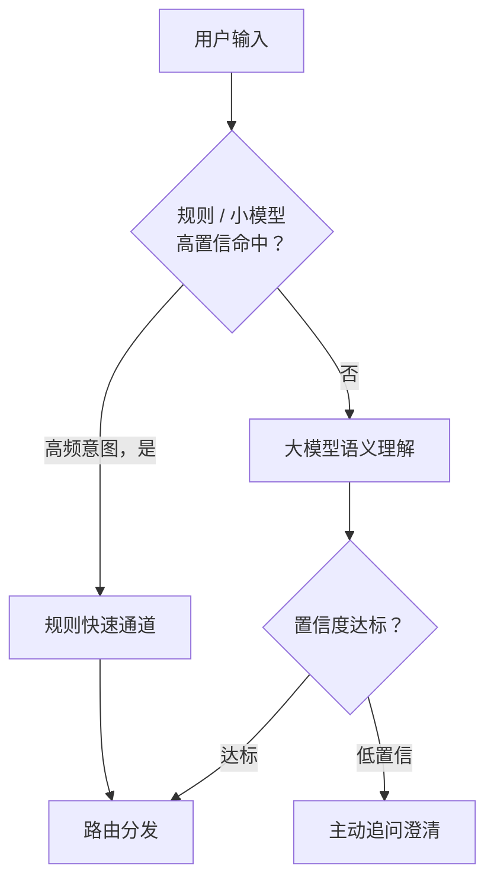
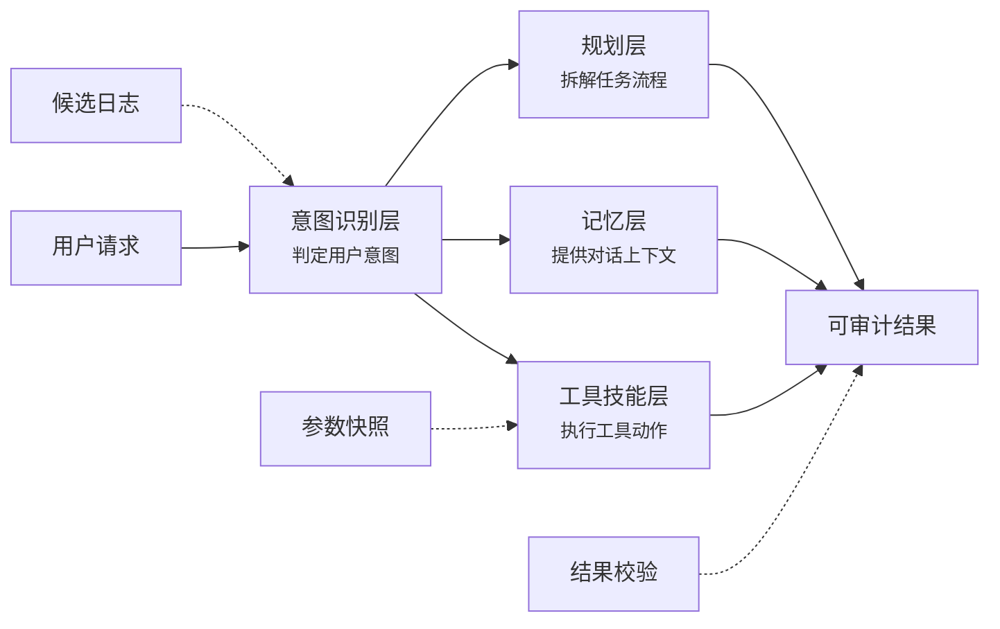
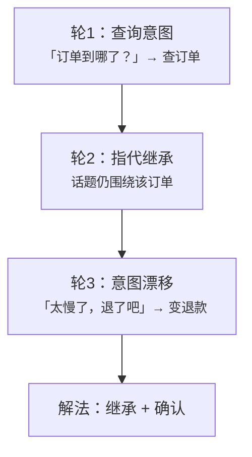

### 两条技术路线：传统 NLU vs 大模型

| 维度     | 传统 NLU              | 大模型                    |
| -------- | --------------------- | ------------------------- |
| 实现方式 | 规则 + 分类小模型     | 提示词（prompt）+ 大模型  |
| 优势     | 快、便宜、可控        | 泛化强、语义理解好        |
| 劣势     | 死板，换个说法就抓瞎  | 慢、贵、不稳定            |

工业界的做法不是二选一，而是**混合路由**。

### 意图识别流水线

走完整条链路，才叫意图识别。标准流水线分六步：



| 环节   | 关键动作   | 说明                                                 |
| ------ | ---------- | ---------------------------------------------------- |
| 输入   | 文本清洗   | 去除噪声与特殊符号、繁简/全半角标准化                |
| 预处理 | 上下文注入 | 清洗输入、补全指代，拼接历史对话与环境状态           |
| 上下文 | 意图分类   | 结合上下文对当前输入进行意图判定，输出意图和参数     |
| 分类   | 阈值判断   | 最高得分与预设阈值比较：高了直接路由，低了主动追问   |
| 置信度 | —          | 输出各意图的概率分布及最高置信度                     |
| 路由   | —          | 按意图分发到对应下游技能、话术或人工坐席             |

### 意图判定的三大信号

意图判定依赖三类信号，缺一不可：

1. **用户说什么**（显式输入）：用户当前这句话的原始文本，是最直接的意图线索
2. **之前聊过什么**（对话上下文）：上一轮说了什么、指代是什么，用于消解省略与指代（如"再来一杯"）
3. **系统里有什么**（环境状态）：用户身份、时间、页面位置、历史行为等内部数据，用于补充与修正判断

> 只看第一类信号的系统，都是半成品。

### 分类 Prompt 这样写

落到工程上，分类 prompt 要写三块：

1. **意图枚举**：system 角色 + 所有意图及边界定义
2. **few-shot 示例**：正例反例都要给，边界更清晰
3. **强制 JSON 输出**：字段包含意图、置信度、抽取参数，下游才能稳定消费

```json
{
  "intent": "query_balance",
  "confidence": 0.92,
  "slots": {
    "account_type": "信用卡",
    "time": "本月"
  }
}
```

### 意图识别四步法

面试答题或落地设计，都可以用这套框架：

1. **定义意图集**：枚举要完整、边界要清晰，每个意图配正反例
2. **语义匹配**：把用户输入映射到候选意图
3. **歧义处理**：出现多个候选意图时，按规则或上下文排除消歧
4. **低置信追问**：置信度不够就主动追问确认，不硬猜

### 常见意图分五类

| 意图类别 | 路由路径 | 说明                           |
| -------- | -------- | ------------------------------ |
| 问答     | FAQ 问答 | 走知识库，命中标准答案         |
| 检索     | RAG 检索 | 检索增强生成，基于私有知识回答 |
| 执行     | 工具调用 | 调用外部工具 / API 完成动作    |
| 创作     | 内容生成 | 走生成流程，产出文案、代码等   |
| 闲聊     | 兜底闲聊 | 未命中以上类别的兜底路径       |

分类不需要多，但每一类的路由路径必须清晰。

### 四种方案怎么选

| 方案   | 优势       | 代价           |
| ------ | ---------- | -------------- |
| 规则   | 可控       | 难维护         |
| 微调   | 快         | 需要标注数据   |
| 大模型 | 灵活       | 成本高         |
| 混合   | 分级路由   | **生产首选**   |

生产级做法：**高频走规则、长尾走大模型、低置信走追问**。



### 意图识别就是 Router

放到整个 Agent 架构里看，意图识别就是 **Router（路由）层**：上面接收用户输入，下面分发到工具、技能、规划模块。Router 判错，后面全错——意图识别的准确率，直接决定 Agent 的上限。



### 真实案例：多轮对话的意图漂移

客服 Agent 场景：第一轮用户问"订单到哪了"，是查询意图；第三轮用户说"太慢了，退了吧"，意图已经漂移成退款。这类情况靠单轮分类必错。



解法是**上下文继承 + 意图切换检测 + 显式确认**：

1. 继承上下文中的实体（哪一笔订单），解决指代问题
2. 检测到意图从"查询"切换为"退款"，而不是沿用旧意图
3. 追加一句确认——"是要申请退款吗？"，避免误执行不可逆操作

### 三个最常见的坑

1. **边界不清**：意图重叠（如"查余额"和"查账单"），必须为每个意图写清定义与正反例
2. **大模型自评不可信**：置信度幻觉——大模型自己给出的置信度不可信，要用线上日志校准
3. **历史噪声干扰**：上下文污染——历史对话里的噪声会带偏分类，要做上下文裁剪

### 五个工程技巧

| 技巧     | 做法            | 目的                     |
| -------- | --------------- | ------------------------ |
| 缓存     | 高频意图缓存    | 省成本、降延迟           |
| few-shot | 正反例 few-shot | 边界更清晰               |
| 兜底     | 兜底话术        | 别让 Agent 硬猜          |
| 日志     | badcase 回流    | 持续修 prompt            |
| 评测集   | 意图评测集      | 每次改动都跑一遍，防回归 |
