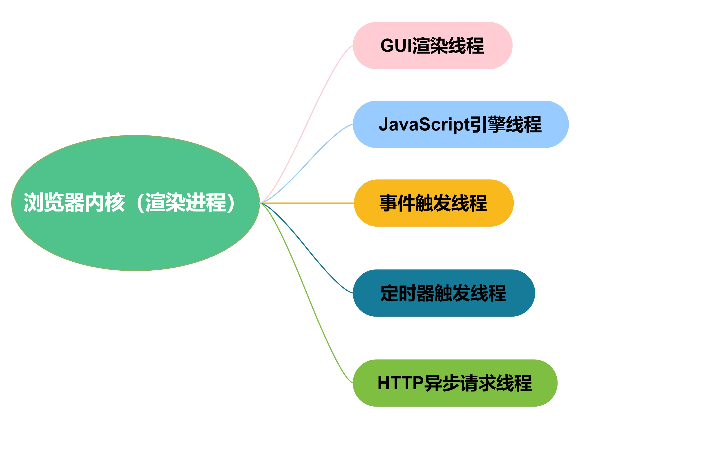
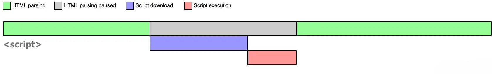
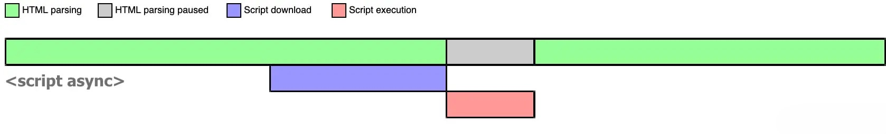
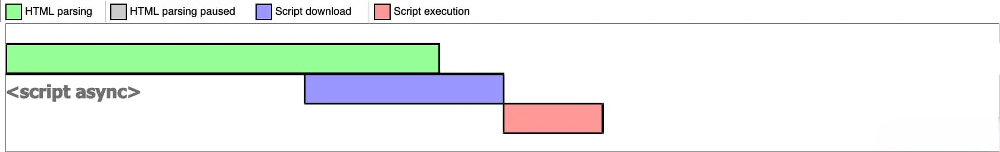
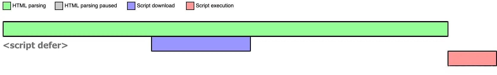
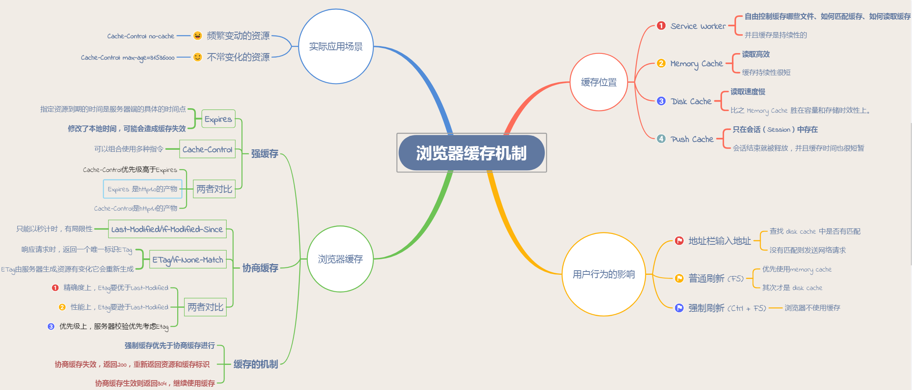

[[toc]]

### 浏览器渲染原理

#### 浏览器内核



- **GUI 渲染线程**：GUI 渲染线程负责渲染浏览器界面，解析 HTML，CSS，构建 DOM 树和 RenderObject 树，布局和绘制等。当界面
  需要重绘（Repaint）或由于某种操作引发回流（Reflow）时，该线程就会执行。
- **JavaScript 引擎线程**: JavaScript 引擎线程主要负责解析 JavaScript 脚本并运行相关代码。 JavaScript 引擎在一个 Tab 页
  （Renderer 进程）中无论什么时候都只有一个 JavaScript 线程在运行 JavaScript 程序。需要提起一点就是，GUI 线程与
  JavaScript 引擎线程是互斥的，这也是就是为什么 JavaScript 操作时间过长，会造成页面渲染不连贯，导致页面出现阻塞的原理。
- **事件触发线程**：当一个事件被触发时该线程会把事件添加到待处理队列的队尾，等待 JavaScript 引擎的处理。 通常 JavaScript
  引擎是单线程的，所以这些事件都会排队等待 JS 执行。
- **定时器触发器**： 我们日常使用的 setInterval 和 setTimeout 就在该线程中，原因可能就是：由于 JS 引擎是单线程的，如果处
  于阻塞线程状态就会影响记时的准确，所以需要通过单独的线程来记时并触发响应的事件这样子更为合理。
- **Http 请求线程**： 在 XMLHttpRequest 在连接后是通过浏览器新开一个线程请求，这个线程就 Http 请求线程，它将检测到状态变
  更时，如果设置有回调函数，异步线程就产生状态变更事件放到 JavaScript 引擎的处理队列中等待处理。

#### 渲染机制

1. 处理 HTML 并构建 DOM 树。
2. 处理 CSS 构建 CSSOM 树。
3. 将 DOM 与 CSSOM 合并成一个渲染树。
4. 根据渲染树来布局，计算每个节点的位置。
5. 调用 GPU 绘制，合成图层，显示在屏幕上。

webkit 内核浏览器渲染流程如下图所示：


在构建 CSSOM 树时，会阻塞渲染，直至 CSSOM 树构建完成。并且构建 CSSOM 树是一个十分消耗性能的过程，所以应该尽量保证层级扁
平，减少过度层叠，越是具体的 CSS 选择器，执行速度越慢。

当 HTML 解析到 script 标签时，会暂停构建 DOM，完成后才会从暂停的地方重新开始。也就是说，如果你想首屏渲染的越快，就越不应
该在首屏就加载 JS 文件。并且 CSS 也会影响 JS 的执行，只有当解析完样式表才会执行 JS，所以也可以认为这种情况下，CSS 也会暂
停构建 DOM。

#### Load 和 DOMContentLoaded 区别

- Load 事件触发代表页面中的 DOM，CSS，JS，图片已经全部加载完毕。
- DOMContentLoaded 事件触发代表初始的 HTML 被完全加载和解析，不需要等待 CSS，JS，图片加载。

#### 图层

一般来说，可以把普通文档流看成一个图层。特定的属性可以生成一个新的图层。不同的图层渲染互不影响，所以对于某些频繁需要渲染
的建议单独生成一个新图层，提高性能。但也不能生成过多的图层，会引起反作用。

通过以下几个常用属性可以生成新图层：

- 3D 变换：translate3d、translateZ
- will-change
- video、iframe 标签
- 通过动画实现的 opacity 动画转换
- position: fixed

#### 重绘（Repaint）和回流（Reflow）

- **重绘**：当我们对 DOM 的修改导致了样式的变化、却并未影响其几何属性（比如修改了颜色或背景色）时，浏览器不需重新计算元
  素的几何属性、直接为该元素绘制新的样式（跳过了上图所示的回流环节）予给元素并重新绘制它，这个过程称为重绘。
- **回流**：当我们对 DOM 的修改引发了 DOM 几何尺寸的变化（比如修改元素的宽、高或隐藏元素等）时，浏览器需要重新计算元素的
  几何属性（其他元素的几何属性和位置也会因此受到影响），然后再将计算的结果绘制出来。这个过程就是回流（也叫重排）
- 回流必定会发生重绘，重绘不一定会引发回流

  触发回流的属性和方法：
  clientWidth、clientHeight、clientTop、clientLeft、offsetWidth、offsetHeight、offsetTop、offsetLeft、scrollWidth、scrollHeight、scrollTop、scrollLeft、scrollIntoView()、scrollIntoViewIfNeeded()、getComputedStyle()、getBoundingClientRect()、scrollTo()

#### async 和 defer

- 浏览器在解析 HTML 的时候，如果遇到一个没有任何属性的 script 标签，就会暂停解析，先发送网络请求获取该 JS 脚本的代码内容
  ，然后让 JS 引擎执行该代码，当代码执行完毕后恢复解析。整个过程如下图所示：

  

- 当浏览器遇到带有 async 属性的 script 时，请求该脚本的网络请求是异步的，不会阻塞浏览器解析 HTML，一旦网络请求回来之后，
  如果此时 HTML 还没有解析完，浏览器会暂停解析，先让 JS 引擎执行代码，执行完毕后再进行解析，图示如下：

  

- 如果在 JS 脚本请求回来之前，HTML 已经解析完毕了，那就啥事没有，立即执行 JS 代码，如下图所示：



- 浏览器遇到带有 defer 属性的 script 时，获取该脚本的网络请求也是异步的，不会阻塞浏览器解析 HTML，一旦网络请求回来之后，
  如果此时 HTML 还没有解析完，浏览器不会暂停解析并执行 JS 代码，而是等待 HTML 解析完毕再执行 JS 代码，图示如下：

  

  | script 标签     | js 执行顺序      | 是否阻塞解析 HTML      |
  | --------------- | ---------------- | ---------------------- |
  | \<script>       | 在 HTML 中的顺序 | 阻塞                   |
  | \<script async> | 网络请求返回顺序 | 可能阻塞，也可能不阻塞 |
  | \<script defer> | 在 HTML 中的顺序 | 阻塞                   |

#### 性能优化策略

- **JS 优化**：\<script> 标签加上 defer 属性 和 async 属性用于在不阻塞页面文档解析的前提下，控制脚本的下载和执行。

  - defer 属性： 用于开启新的线程下载脚本文件，并使脚本在文档解析完成后执行。
  - async 属性： HTML5 新增属性，用于异步下载脚本文件，下载完毕立即解释执行代码。

- **CSS 优化**： <link> 标签的 rel 属性 中的属性值设置为 preload 能够让你在你的 HTML 页面中可以指明哪些资源是在页面加 载
  完成后即刻需要的,最优的配置加载顺序，提高渲染性能

::: tip 总结

1. 浏览器工作流程：构建 DOM -> 构建 CSSOM -> 构建渲染树 -> 布局 -> 绘制。
2. CSSOM 会阻塞渲染，只有当 CSSOM 构建完毕后才会进入下一个阶段构建渲染树。
3. 通常情况下 DOM 和 CSSOM 是并行构建的，但是当浏览器遇到一个不带 defer 或 async 属性的 script 标签时，DOM 构建将暂停，
   如果此时又恰巧浏览器尚未完成 CSSOM 的下载和构建，由于 JavaScript 可以修改 CSSOM，所以需要等 CSSOM 构建完毕后再执行
   JS，最后才重新 DOM 构建。
4. [参考链接](https://juejin.cn/post/6847902222349500430)

:::

### 浏览器存储

| 特性         | cookie                                   | localStorage | sessionStorage   | indexDB  |
| ------------ | ---------------------------------------- | ------------ | ---------------- | -------- |
| 数据生命周期 | 一般由服务器生成，可以设置过期时间       | 手动清理     | 页面关闭自动清理 | 手动清理 |
| 数据存储大小 | 4KB                                      | 5MB          | 5MB              | 无限制   |
| 与服务端通信 | 每次都会携带 header 中，对于请求影响性能 | -            | -                | -        |

::: tip 总结

1. Cookie 的本职工作并非本地存储，而是“维持状态”。
2. Web Storage 定义了两个对象用于存储数据：sessionStorage 和 localStorage。前者用于严格保存浏览器一次会话期间的数据，因
   为数据会在浏览器关闭时被删除。后者用于会话之外持久保存数据。
3. IndexedDB 是类似于 SQL 数据库的结构化数据存储机制。不同的是，IndexedDB 存储的是对象，而不是数据表。

:::

### 浏览器缓存



#### 缓存位置

- **Service Worker**：浏览器独立线程，可以控制缓存哪些文件、如何匹配缓存、如何读取缓存，并且缓存是持续性的。首先需要先注
  册 Service Worker，然后监听到 install 事件以后就可以缓存需要的文件，那么在下次用户访问的时候就可以通过拦截请求的方式查
  询是否存在缓存，存在缓存的话就可以直接读取缓存文件，否则就去请求数据
- **Memory Cache**：内存中的缓存，关闭 Tab 页面，内存中的缓存也就被释放了。内存缓存在缓存资源时并不关心返回资源的 HTTP
  缓存头 Cache-Control 是什么值，同时资源的匹配也并非仅仅是对 URL 做匹配，还可能会对 Content-Type，CORS 等其他特征做校验
  。
- **Disk Cache**：硬盘中的缓存
- **Push Cache**：推送缓存，是 HTTP/2 中的内容，当以上三种缓存都没有命中时，它才会被使用。它只在会话（Session）中存在，
  一旦会话结束就被释放，并且缓存时间也很短暂

#### 强缓存

不会向服务器发送请求，直接从缓存中读取资源，强缓存可以通过设置两种 HTTP Header 实现：Expires 和 Cache-Control。

- **Expires**：缓存过期时间，用来指定资源到期的时间，是服务器端的具体的时间点。如果修改了本地时间，可能会造成缓存失效
- **Cache-Control**：主要用于控制网页缓存
  - **public**：所有内容都将被缓存（客户端和代理服务器都可缓存）
  - **private**：所有内容只有客户端可以缓存，Cache-Control 的默认取值
  - **no-cache**：客户端缓存内容，是否使用缓存则需要经过协商缓存来验证决定。表示不使用 Cache-Control 的缓存控制方式做前
    置验证，而是使用 Etag 或者 Last-Modified 字段来控制缓存。需要注意的是，no-cache 这个名字有一点误导。设置了 no-cache
    之后，并不是说浏览器就不再缓存数据，只是浏览器在使用缓存数据时，需要先确认一下数据是否还跟服务器保持一致。
  - **no-store**：所有内容都不会被缓存，即不使用强制缓存，也不使用协商缓存
  - **max-age**：max-age=60，表示缓存内容将在 60s 后失效
  - **s-maxage**：同 max-age 作用一样，只在代理服务器中生效（比如 CDN 缓存）。比如当 s-maxage=60 时，在这 60 秒中，即使
    更新了 CDN 的内容，浏览器也不会进行请求。max-age 用于普通缓存，而 s-maxage 用于代理缓存。s-maxage 的优先级高于
    max-age。如果存在 s-maxage，则会覆盖掉 max-age 和 Expires header。
  - **max-stale**：能容忍的最大过期时间。max-stale 指令标示了客户端愿意接收一个已经过期了的响应。如果指定了 max-stale 的
    值，则最大容忍时间为对应的秒数。如果没有指定，那么说明浏览器愿意接收任何 age 的响应（age 表示响应由源站生成或确认的
    时间与当前时间的差值）。
  - **min-fresh**：能够容忍的最小新鲜度。min-fresh 标示了客户端不愿意接受新鲜度不多于当前的 age 加上 min-fresh 设定的时
    间之和的响应。
- Expires 是 http1.0 的产物，Cache-Control 是 http1.1 的产物，两者同时存在的话，Cache-Control 优先级高于 Expires；在某些
  不支持 HTTP1.1 的环境下，Expires 就会发挥用处。所以 Expires 其实是过时的产物，现阶段它的存在只是一种兼容性的写法。

#### 协商缓存

协商缓存就是强制缓存失效后，浏览器携带缓存标识向服务器发起请求，由服务器根据缓存标识决定是否使用缓存的过程，主要有以下两
种情况：

- 协商缓存生效，返回 304 和 Not Modified
- 协商缓存失效，返回 200 和请求结果

| 消息报头          | 示例                               | 类型 | 作用                                                                                                                                                                                                                                                                                                                                                                                                            |
| ----------------- | ---------------------------------- | ---- | --------------------------------------------------------------------------------------------------------------------------------------------------------------------------------------------------------------------------------------------------------------------------------------------------------------------------------------------------------------------------------------------------------------- |
| Last-Modified     | Mon, 15 Aug 2016 03:56:47 GMT      | 响应 | 告诉浏览器这个资源最后的修改时间。服务器将资源传递给客户端时，会将资源最后更改的时间以“Last-Modified: GMT”的形式加在实体首部上一起返回给客户端【只能精确到秒级，如果某些文件在 1 秒钟以内，被修改多次的话，它将不能准确标注文件的修改时间】                                                                                                                                                                     |
| If-Modified-Since | Mon, 15 Aug 2016 03:56:47 GMT      | 请求 | 其值为上次响应头的 Last-Modified 值，再次向 web 服务器请求时带上头 If-Modified-Since。web 服务器收到请求后发现有头 If-Modified-Since 则与被请求资源的最后修改时间进行比对。若最后修改时间较新，说明资源又被改动过，则响应整片资源内容（写在响应消息包体内），包括更新 Last-Modified 的值，HTTP 200；若最后修改时间较旧，说明资源无新修改，则响应 HTTP 304(无需请求，节省浏览)，告知浏览器继续使用所保存的 cache |
| ETag              | "fd56273325a2114818df4f29a628226d" | 响应 | 告诉浏览器当前资源在服务器的唯一标识符（生成规则由服务器决定）                                                                                                                                                                                                                                                                                                                                                  |
| If-None-Match     | "fd56273325a2114818df4f29a628226d" | 请求 | 当资源过期时（使用 Cache-Control 标识的 max-age），发现资源具有 Etage 声明，则再次向 web 服务器请求时带上头 If-None-Match（Etag 的值）。web 服务器收到请求后发现有头 If-None-Match 则与被请求资源的相应校验串进行比对，决定返回 200 或 304                                                                                                                                                                      |

#### 缓存机制

强制缓存优先于协商缓存进行，若强制缓存(Expires 和 Cache-Control)生效则直接使用缓存，若不生效则进行协商缓存(Last-Modified
/ If-Modified-Since 和 Etag / If-None-Match)，协商缓存由服务器决定是否使用缓存，若协商缓存失效，那么代表该请求的缓存失效
，返回 200，重新返回资源和缓存标识，再存入浏览器缓存中；生效则返回 304，继续使用缓存。

#### 常用缓存策略

- **频繁变动的资源**：对于频繁变动的资源，首先需要使用 Cache-Control: no-cache 使浏览器每次都请求服务器，然后配合 ETag
  或者 Last-Modified 来验证资源是否有效。这样的做法虽然不能节省请求数量，但是能显著减少响应数据大小。

- **不常变化的资源**：通常在处理这类资源时，给它们的 Cache-Control 配置一个很大的 max-age=31536000 (一年)，这样浏览器之
  后请求相同的 URL 会命中强制缓存。而为了解决更新的问题，就需要在文件名(或者路径)中添加 hash， 版本号等动态字符，之后更
  改动态字符，从而达到更改引用 URL 的目的，让之前的强制缓存失效 (其实并未立即失效，只是不再使用了而已)。在线提供的类库 (
  如 jquery-3.3.1.min.js, lodash.min.js 等) 均采用这个模式。

#### 用户行为对浏览器缓存的影响

- **打开网页，地址栏输入地址**： 查找 disk cache 中是否有匹配。如有则使用；如没有则发送网络请求。
- **普通刷新 (F5)**：因为 TAB 并没有关闭，因此 memory cache 是可用的，会被优先使用(如果匹配的话)。其次才是 disk cache。
- **强制刷新 (Ctrl + F5)**：浏览器不使用缓存，因此发送的请求头部均带有 Cache-control: no-cache(为了兼容，还带了 Pragma:
  no-cache),服务器直接返回 200 和最新内容。

#### 不能缓存的请求

- post 请求无法被缓存。
- 需要根据 cookie、认证信息等决定输入内容的动态请求不能被缓存。
- http 响应头中不包含 Last-Modified/ETag，也不包含 Cache-Control/Expiress 的请求无法被缓存。
- http 信息头明确设置 Cache-Control:no-cache,pragma:no-cache 或 Cache-Control:max-age=0 浏览器不缓存时。

### 获取 URL 中的参数

```javascript
const getURLParameters = url =>
  (url.match(/([^?=&]+)(=([^&]*))/g) || []).reduce(
    (a, v) => ((a[v.slice(0, v.indexOf('='))] = v.slice(v.indexOf('=') + 1)), a),
    {}
  );

//Examples

getURLParameters('google.com');
// {}

getURLParameters('http://url.com/page?name=Adam&surname=Smith');
// {name: 'Adam', surname: 'Smith'}
```

- [参考链接](https://www.30secondsofcode.org/js/s/get-url-parameters)
