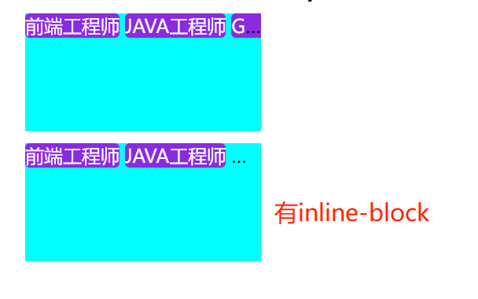

[[toc]]

### CSS 选择器优先级

1. 基础规则：important > 行内样式 > ID 选择器 > 类选择器 > 元素选择器 > 通配符选择器
2. 详细规则：每一个选择则器可以计算出一个【权重值】，格式为(a,b,c)，优先比较 a，在比较 b，在比较 c，相同权重后面的优先级
   高于前面的（不包含 important）
   - a 表示：一个选择器中【ID】选择器的个数
   - b 表示：一个选择器中【类、伪类、属性】选择器的个数
   - c 表示：一个选择器中【元素、伪元素】选择器的个数

```html
<style>
  /* 类：a、list */
  /* 元素：div、ul、li */
  /* 权重值(0,2,3) */
  div.a ul.list li {
    color: red;
  }

  /* 类：a */
  /* 元素：div、ul、li */
  /* 权重值(0,1,3) */
  div.a > ul > li {
    color: blue;
  }

  /* 类：a ，属性：a="aul"*/
  /* 元素：ul、li */
  /* 权重值(0,2,2) */
  .a ul[a='aul'] > li {
    color: green;
  }
</style>
<div class="a">
  <h2>A</h2>
  <ul class="list" a="aul">
    <li>A1</li>
    <li>A2</li>
    <li>A3</li>
  </ul>
</div>
<div class="b">
  <h2>B</h2>
  <ul class="list">
    <li>B1</li>
    <li>B2</li>
    <li>B3</li>
  </ul>
</div>
```

### fixed 定位失效

由于 fixed 的基准元素发生了变化导致定位失效，有以下几种方式：

1. transform 属性不为 none 的元素
2. 设置了 transform-style:preserve-3d 的元素
3. perspective 值不为 none 的元素
4. 在 will-change 中指定了任意 css 属性
5. 设置了 contain：paint
6. filter 值不为 none 的元素
7. backdrop-filter 值不为 none 的元素

```html
<!DOCTYPE html>
<html>
  <head>
    <meta charset="utf-8" />
    <title></title>
    <style type="text/css">
      * {
        padding: 0;
        margin: 0;
      }
      #father {
        width: 10vw;
        height: 10vh;
        background-color: red;
        transform: translate3d(0, 0, 0);
      }
      #son {
        position: fixed;
        left: 1vw;
        top: 1vw;
        right: 1vw;
        bottom: 1vw;
        background-color: green;
      }
    </style>
  </head>
  <body>
    <h3>transform不为none导致fixed失效</h3>
    <div id="father">
      <div id="son"></div>
    </div>
  </body>
</html>
```

### 单行省略技巧

```html
<!DOCTYPE html>
<html>
  <head>
    <meta charset="utf-8" />
    <title></title>
    <style type="text/css">
      * {
        padding: 0;
        margin: 0;
      }
      .container {
        width: 200px;
        height: 100px;
        background-color: aqua;
        overflow: hidden;
        white-space: nowrap;
        text-overflow: ellipsis;
      }
      span {
        color: white;
        background-color: blueviolet;
        border-radius: 4px;
        /* display: inline-block; */
      }
    </style>
  </head>
  <body>
    <h3>span的样式不加inline-block时会截断span中的文字显示，增加inline-block会省略整个span</h3>
    <div class="container">
      <span>前端工程师</span>
      <span>JAVA工程师</span>
      <span>GO工程师</span>
    </div>
  </body>
</html>
```




### Select 下拉框的样式调试

打开`DevTools`的 `More tools` 菜单，选择 `Rendering`，在打开的 Rendering 面板中，勾选 `Emulate a focused page`