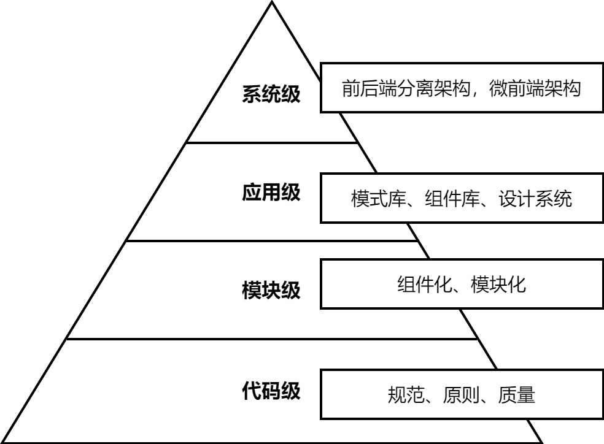

[[toc]]

### 架构分级

- **系统内架构**：应用在整个系统内的关系，如与后台服务器通信、与第三方系统集成等
- **应用级架构**：应用外部的整体架构，如多个应用之间如何共享组件、如何通信等
- **模块级架构**：应用内部模块架构，如代码模块化、数据和状态的管理等
- **代码级架构**：从基础设施来保障架实施

### 好的软件设计(SOLID)

- S：单一职责原则（SRP）
  - 一个程序只做好一件事
  - 如果功能过于复杂就拆开，每个部分保持独立
- O: 开闭原则 (OSP)
  - 对扩展开发，对修改封闭
  - 增加需求时，扩展新代码，而非修改已有代码
- L : 里氏替换原则 (LSP)
  - 子类能覆盖父类
  - 父类能出现的地方子类就能出现
- I：接口隔离原则（ISP）
  - 保持接口的单一独立
  - 类似单一职责，这里更关注接口
- D：依赖倒置原则（DIP）
  - 面向接口编程，依赖于抽象而不依赖于具体
  - 使用方只关注接口而不关注具体类的实现
