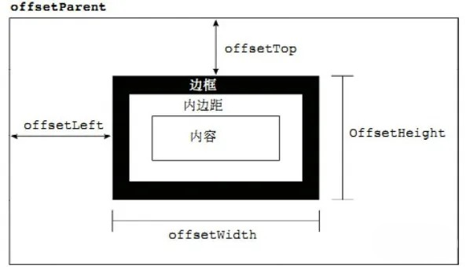
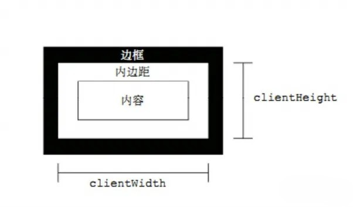
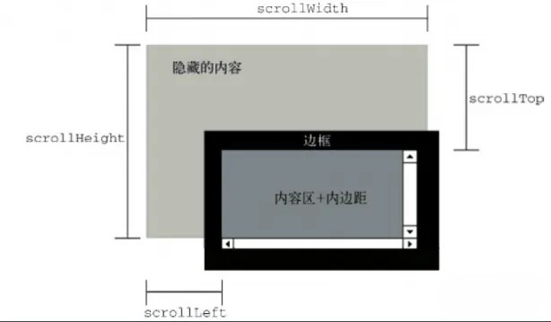
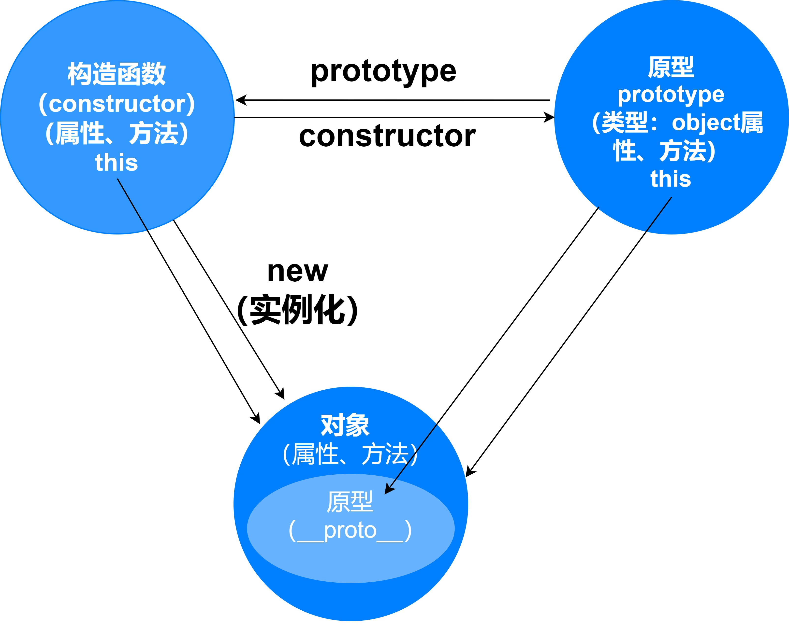
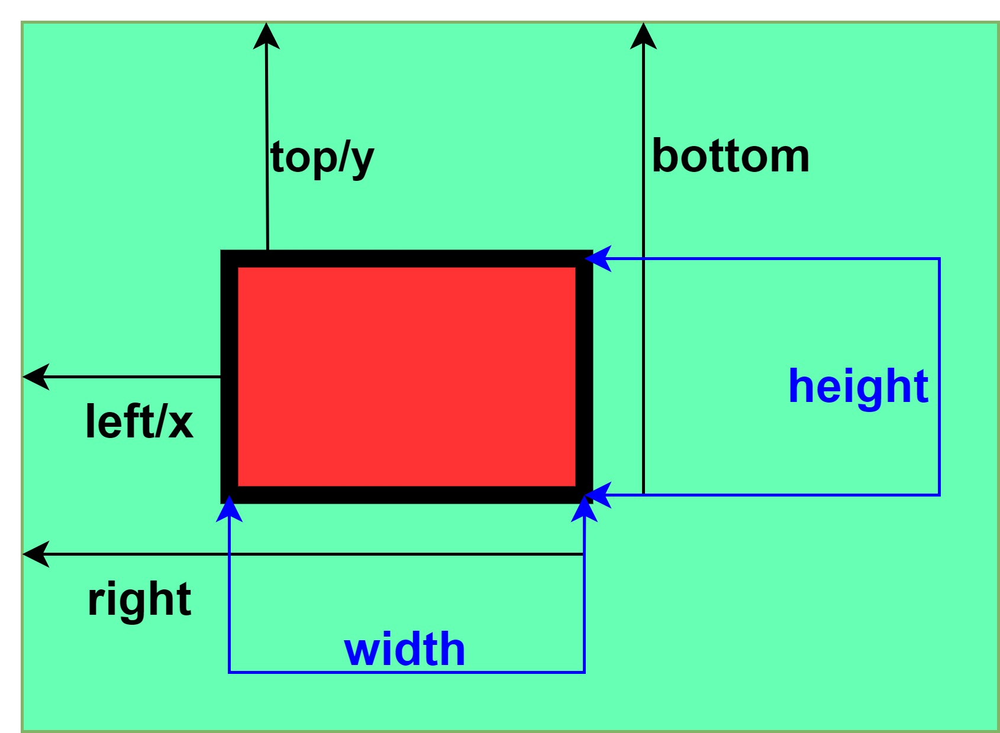

[[toc]]

### offset



- offsetParent：定位父级
  1. 元素自身有 fixed 定位，offsetParent 的结果为 null
  2. 元素自身无 fixed 定位，且父元素都没有设置定位，offsetParent 的结果为 body
  3. 元素自身无 fixed 定位，且父级元素存在经过定位的元素，offsetParent 的结果为离自身元素最近的经过定位的父级元素
  4. \<body>元素的 offsetParent 是 null
- offsetWidth：元素在水平方向上占用的空间大小，无单位(以像素 px 计)，offsetWidth = border-left-width + padding-left +
  width + padding-right + border-right-width;
- offsetHeight：offsetHeight 表示元素在垂直方向上占用的空间大小，无单位(以像素 px 计)，offsetHeight = border-top-width +
  padding-top + height + padding-bottom + border-bottom-width
- offsetTop：表示元素的上外边框至 offsetParent 元素的上内边框之间的像素距离
- offsetLeft：表示元素的左外边框至 offsetParent 元素的左内边框之间的像素距离
  ### client
  
- clientWidth：表示元素节点的客户区宽度，clientWidth = padding-left + width + padding-right
- clientHeight：表示元素节点的客户区高度，clientHeight = padding-top + height + padding-bottom
- clientLeft：表示左边框的宽度
- clientTop：表示上边框的宽度

  1. 所有的 client 属性都是只读的
  2. 如果给元素设置了 display:none，则客户区 client 属性都为 0
  3. 每次访问客户区 client 属性都需要重新计算，重复访问需要耗费大量的性能，所以要尽量避免重复访问这些属性。如果需要重复
     访问，则把它们的值保存在变量中，以提高性能

  ### scroll

  

- scrollWidth：元素的总宽度，包括由于溢出而无法展示在网页的不可见部分
- scrollHeight：元素的总高度，包括由于溢出而无法展示在网页的不可见部分
  1. 没有滚动条时，scrollHeight 与 clientHeight 属性结果相等，scrollWidth 与 clientWidth 属性结果相等
  2. 存在滚动条时，但元素设置宽高大于等于元素内容宽高时，scroll 和 client 属性的结果相等
- scrollTop：表示被隐藏在内容区域上方的像素数。元素未滚动时，scrollTop 的值为 0，如果元素被垂直滚动了，scrollTop 的值大
  于 0，表示元素上方不可见内容的像素高度
- scrollLeft：表示被隐藏在内容区域左侧的像素数。元素未滚动时，scrollLeft 的值为 0，如果元素被水平滚动了，scrollLeft 的值
  大于 0，且表示元素左侧不可见内容的像素宽度
  1. 当滚动条滚动到内容底部时，符合以下等式：scrollHeight = scrollTop + clientHight
  2. 与 scrollHeight 和 scrollWidth 属性不同的是，scrollLeft 和 scrollTop 是可写的
  3. 大部分的浏览器通过 document.documentElement.scrollTop 和 scrollLeft 可以反映和控制页面的滚动；safari 浏览器是通过
     document.body.scrollTop 和 scrollLeft 来控制的
  4. 页面的滚动高度兼容写法：docScrollTop = document.documentElement.scrollTop || document.body.scrollTop
  5. 回到顶部： document.documentElement.scrollTop = document.body.scrollTop = 0;
- scrollTo(x,y)：当前 window 中显示的文档，让文档中由坐标 x 和 y 指定的点位于显示区域的左上角

### MouseEvent


- altkey：触发鼠标事件时是否 alt 按键被按下,如果按下，则返回 true，否则返回 fasle
- button：事件属性返回一个阿拉伯数字 ， 0 代表 按下 左键 ，1 代表按下 滚轮 ，2 代表按下 右键
- offsetX、offsetY：事件属性返回触发事件时 鼠标相对于事件源元素 的 X,Y 坐标，标准事件没有对应的属性
- clientX、clientY：事件属性返回当事件被触发时鼠标指针相对于浏览器页面（或客户区）的水平坐标、垂直坐标
- pageX、pageY：事件属性返回当事件被触发时鼠标指针相对于整个页面左上角的水平坐标、垂直坐标
- screenX、screenY：事件属性返回当事件被触发时鼠标位置相对于用户屏幕水水平坐标、垂直坐标，此时的参照点也就是原点是屏幕的
  左上角

### prototype 和\_\_proto\_\_关系？

所有对象都有\_\_proto\_\_属性，函数这个特殊对象除了具有\_\_proto\_\_属性，还特有的原型属性 prototype。prototype 对象默认
有 2 个属性，constructor 属性和\_\_proto\_\_属性。prototype 属性可以给函数和对象添加可共享的（继承）的方法、属性，而
\_\_proto\_\_是查找某函数或对象的原型链方式。constructor 这个属性包含了一个指针，指回原构造函数。



### getBoundingClientRect

Element.getBoundingClientRect() 方法返回元素的大小及其相对于视口的位置。返回的是一个对象，对象里有这 8 个属性：

- left/x：元素左边到视窗左边的距离
- right：元素右边到视窗左边的距离
- top/y：元素上边到视窗上边的距离
- bottom：元素下边到视窗上边的距离
- width：是元素自身的宽（包含了 padding 和 border-width）
- height：是元素自身的高（包含了 padding 和 border-width）



### IntersectionObserver

IntersectionObserver 接口（从属于 Intersection Observer API）提供了一种异步观察目标元素与其祖先元素或顶级文档视口
（viewport）交叉状态的方法。其祖先元素或视口被称为根（root）。

```javascript
const IntersectionObserverEntryObj = {
  // 可见性发生变化的时间，是一个高精度时间戳，单位为毫秒
  time: 3893.92,
  // 根元素的矩形区域的信息，getBoundingClientRect()方法的返回值，如果没有根元素（即直接相对于视口滚动），则返回null
  rootBounds: {
    bottom: 920,
    height: 1024,
    left: 0,
    right: 1024,
    top: 0,
    width: 920,
  },
  // 目标元素的矩形区域的信息
  boundingClientRect: {
    // ...
  },
  // 目标元素与视口（或根元素）的交叉区域的信息
  intersectionRect: {
    // ...
  },
  // 目标元素的可见比例，即intersectionRect占boundingClientRect的比例，完全可见时为1，完全不可见时小于等于0
  intersectionRatio: 0.54,
  // 被观察的目标元素，是一个 DOM 节点对象
  target: element,
};

/**
 *
 * @param {一个IntersectionObserverEntry对象的数组，每个被触发的阈值，都或多或少与指定阈值有偏差} entries
 * @param {被调用的IntersectionObserver实例} observer
 */
const callback = (entries, observer) => {};

const options = {
  // 监听元素的祖先元素Element对象，其边界盒将被视作视口。目标在根的可见区域的的任何不可见部分都会被视为不可见。
  root: document.querySelector('#container'),
  // 一个在计算交叉值时添加至根的边界盒中的一组偏移量，类型为字符串 (string) ，可以有效的缩小或扩大根的判定范围从而满足计算需要
  rootMargin: '0px 0px 0px 0px',
  // 规定了一个监听目标与边界盒交叉区域的比例值，可以是一个具体的数值或是一组 0.0 到 1.0 之间的数组。若指定值为 0.0，则意味着监听元素即使与根有 1 像素交叉，此元素也会被视为可见。若指定值为 1.0，则意味着整个元素都在可见范围内时才算可见。[0, 0.25, 0.5, 0.75, 1]就表示当目标元素 0%、25%、50%、75%、100% 可见时，会触发回调函数
  threshold: [0, 0.25, 0.5, 0.75, 1],
};

// 接收两个参数 callback和option
// callback：当元素可见比例超过指定阈值后，会调用一个回调函数，此回调函数接受两个参数
// 如果options未指定，observer 实例默认使用文档视口作为 root，并且没有 margin，阈值为 0%（意味着即使一像素的改变都会触发回调函数）
const intersectionObserver = new IntersectionObserver(callback, option);

// 开始观察(可观察多个元素)
const ele1 = document.querySelector('#example1');
const ele2 = document.querySelector('#example2');
intersectionObserver.observe(ele1);
intersectionObserver.observe(ele2);

// 停止观察某个元素
intersectionObserver.unobserve(ele1);

// 关闭观察器
intersectionObserver.disconnect();
```

### createNodeIterator

用于创建节点迭代器，因此，使用该节点迭代器，我们可以在节点上进行迭代

```javascript
// 遍历页面中所有元素
const body = document.getElementsByTagName('body')[0];
const it = document.createNodeIterator(body);
let root = it.nextNode();
while (root) {
  console.log(root);
  root = it.nextNode();
}
```

### getComputedStyle

window.getComputedStyle()方法返回一个对象，该对象在应用活动样式表并解析这些值可能包含的任何基本计算后报告元素的所有 CSS
属性的值。 私有的 CSS 属性值可以通过对象提供的 API 或通过简单地使用 CSS 属性名称进行索引来访问。

### requestAnimationFrame

背景：

传统的 javascript 动画是通过定时器 setTimeout 或者 setInterval 实现的。但是定时器动画一直存在两个问题，第一个就是动画的
循时间环间隔不好确定，设置长了动画显得不够平滑流畅，设置短了浏览器的重绘频率会达到瓶颈，推荐的最佳循环间隔是 17ms（大多
数电脑的显示器刷新频率是 60Hz，1000ms/60）；第二个问题是定时器第二个时间参数只是指定了多久后将动画任务添加到浏览器的 UI
线程队列中，如果 UI 线程处于忙碌状态，那么动画不会立刻执行。为了解决这些问题，H5 中加入了 requestAnimationFrame

优点：

1. requestAnimationFrame 会把每一帧中的所有 DOM 操作集中起来，在一次重绘或回流中就完成，并且重绘或回流的时间间隔紧紧跟随
   浏览器的刷新频率
2. 在隐藏或不可见的元素中，requestAnimationFrame 将不会进行重绘或回流，这当然就意味着更少的 CPU、GPU 和内存使用量
3. requestAnimationFrame 是由浏览器专门为动画提供的 API，在运行时浏览器会自动优化方法的调用，并且如果页面不是激活状态下
   的话，动画会自动暂停，有效节省了 CPU 开销

```javascript
// 动画：点击元素时开始转动，再次点击转动速速增加。
let deg = 0;
let id;
const div = document.getElementById('div');
div.addEventListener('click', () => {
  requestAnimationFrame(function change() {
    div.style.transform = 'rotate(' + deg++ + 'deg)';
    id = requestAnimationFrame(change);
  });
});
document.getElementById('stop').onclick = () => {
  cancelAnimationFrame(id);
};

// 大数据渲染：在大数据渲染过程中，比如表格的渲染，如果不进行一些性能策略处理，就会出现 UI 冻结现象，用户体验极差。有个场景，将后台返回的十万条记录插入到表格中，如果一次性在循环中生成 DOM 元素，会导致页面卡顿5s左右。这时候我们就可以用 requestAnimationFrame 进行分步渲染，确定最好的时间间隔，使得页面加载过程中很流畅
const total = 100000;
const size = 100;
const count = total / size;
let done = 0;
const ul = document.getElementById('list');

function addItems() {
  let li = null;
  let fg = document.createDocumentFragment();

  for (let i = 0; i < size; i++) {
    li = document.createElement('li');
    li.innerText = 'item ' + (done * size + i);
    fg.appendChild(li);
  }

  ul.appendChild(fg);
  done++;

  if (done < count) {
    requestAnimationFrame(addItems);
  }
}

requestAnimationFrame(addItems);
```

### requestIdleCallback

当关注用户体验，不希望因为一些不重要的任务（如统计上报）导致用户感觉到卡顿的话，就应该考虑使用 requestIdleCallback。因为
requestIdleCallback 回调的执行的前提条件是当前浏览器处于空闲状态

```javascript
// 如果指定了 timeout，并且有一个正值，而回调在 timeout 毫秒过后还没有被调用，那么回调任务将放入事件循环中排队，即使这样做有可能对性能产生负面影响。
requestIdleCallback(myNonEssentialWork, { timeout: 2000 });

function myNonEssentialWork(deadline) {
  // 当回调函数是由于超时才得以执行的话，deadline.didTimeout为true
  while ((deadline.timeRemaining() > 0 || deadline.didTimeout) && tasks.length > 0) {
    doWorkIfNeeded();
  }
  if (tasks.length > 0) {
    requestIdleCallback(myNonEssentialWork);
  }
}
```

### 前端模块化：CommonJS,ESM

- CommonJS 模块输出的是一个值的拷贝，ES6 模块输出的是值的引用。
- CommonJS 模块是运行时加载，ES6 模块是编译时输出接口。

### toString()和 valueOf()

- `toString`：返回一个表示该对象的字符串，当对象表示为文本值或以期望的字符串方式被引用时，toString 方法被自动调用。
- `valueOf`：返回当前对象的原始值
- `[Symbol.toPrimitive]`：是一个内置的 Symbol 值，它是作为对象的函数值属性存在的，当一个对象转换为对应的原始值时，会调用此函数。

1. 在进行对象转换时，将优先调用 toString 方法，如若没有重写 toString，将调用 valueOf 方法；如果两个方法都没有重写，则按 Object 的 toString 输出。
2. 在进行强转字符串类型时，将优先调用 toString 方法，强转为数字时优先调用 valueOf。
3. 使用运算操作符的情况下，valueOf 的优先级高于 toString。
4. `[Symbol.toPrimitive]`优先级高于`valueOf`和`toString`，此方法不兼容 IE
5. `[Symbol.toPrimitive]`函数被调用时，会被传递一个字符串参数 hint，表示当前运算的模式，一共有三种模式：
   - string：字符串类型
   - number：数字类型
   - default：默认

```javascript
class A {
  constructor(count) {
    this.count = count;
  }
  valueOf() {
    return 2;
  }
  toString() {
    return '哈哈哈';
  }
  [Symbol.toPrimitive](hint) {
    if (hint == 'number') {
      return 10;
    }
    if (hint == 'string') {
      return 'Hello Libai';
    }
    return true;
  }
}

const a = new A(10);

console.log(`${a}`); // 'Hello Libai' => (hint == "string")
console.log(String(a)); // 'Hello Libai' => (hint == "string")
console.log(+a); // 10            => (hint == "number")
console.log(a * 20); // 200           => (hint == "number")
console.log(a / 20); // 0.5           => (hint == "number")
console.log(Number(a)); // 10            => (hint == "number")
console.log(a + '22'); // 'true22'      => (hint == "default")
console.log(a == 10); // false        => (hint == "default")
```

### this 指向

- 默认绑定规则

  ```javascript
  console.log(this === window); // true
  // 函数独立调用，指向window
  function func() {
    console.log(this === window); // true
  }
  ```

- 隐式调用规则，谁调用指向谁

  ```javascript
  let i = 0;
  let obj = {
    i: 1,
    func() {
      console.log(this);
      function test() {
        console.log(this);
      }
      // 函数独立调用，指向window
      test();
    },
  };

  obj.func(); // this===obj

  // 有难度
  function fn() {
    console.log(this); // this === list
  }
  let list = [fn, 1, 2, 3, 4];
  list[0]();

  var length = 1; // 此处测试时不能使用let，否则window调用时length是undefined
  function fn() {
    console.log(this.length);
  }
  let obj = {
    length: 100,
    action(callback) {
      // fn中的this===window，this.length === window.length === 1
      callback();
      // fn内的this===arguments, this.length === arguments.length === 5
      arguments[0]();
    },
  };
  let arr = [1, 2, 3, 4];
  obj.action(fn, ...arr);
  ```

- 显示绑定：bind、call、apply

  ```javascript
  let obj = {
    i: 1,
    func(a, b) {
      console.log(this);
    },
  };

  let bar = obj.func;

  obj.func(1, 2); // obj
  bar(1, 2); // window
  obj.call(obj, 1, 2); // obj
  obj.apply(obj, [1, 2]); // obj
  obj.bind(obj)(1, 2); // obj
  obj.call(null, 1, 2); // window
  obj.call(undefined, 1, 2); // window
  ```

- new 绑定

```javascript
function Person() {
  this.name = 'zs';
  console.log(this);
}
let p1 = new Person(); // this指向p1
```

::: warning 优先级
new>显示绑定>隐式绑定>默认绑定
:::

### 稀疏数组和密集数组

- 稀疏数组：索引不连续，数组长度大于元素个数的数组, 可以简单理解为有 empty 的数组
- 密集数组：索引连续, 数组长度等于元素个数的数组

```javascript
// 稀疏数组  [empty × 5]
let arr1 = new Array(5);

// 密集数组 [null, null, null, null, null]
let arr2 = new Array(5).fill(null);
```

稀疏数组在大多数遍历数组的方法中，遇到「empty」元素的时候，callback 函数是不会执行的，如：map, forEach, filter 等, 在 for...in 语句中同样适用

### 迭代对象上所有的属性

```javascript
Array.prototype.BB = 200;
let arr = [1, 2, 3];
arr[Symbol('A')] = 100;
let keys1 = [];
for (let key in arr) {
  keys1.push(key);
}
// ['0', '1', '2', 'BB']，for...in迭代“可枚举、非Symbol”类型，会查找原型上的属性
console.log(`🚀 ~ file: jsxHandle.js:18 ~ keys1:`, keys1);
// ['0', '1', '2', 'length', Symbol(A)]，兼容性好
let keys2 = [...Object.getOwnPropertyNames(arr), ...Object.getOwnPropertySymbols(arr)];
console.log(`🚀 ~ file: jsxHandle.js:20 ~ keys:`, keys2);
let keys3 = Reflect.ownKeys(arr);
// ['0', '1', '2', 'length', Symbol(A)]，IE不支持
console.log(`🚀 ~ file: jsxHandle.js:22 ~ keys3:`, keys3);
```

### 对象规则设置

- 冻结：被冻结的对象不能新增、删除、修改、劫持（Object.defineProperty）
  - 冻结对象：Object.freeze(obj)
  - 检测对象是否被冻结：Object.isFrozen(obj) => true/false
- 密封：被密封的对象不能新增、删除、劫持
  - 密封对象：Object.seal(obj)
  - 检测对象是否被密封：Object.isSealed(obj) => true/false
- 扩展：被阻止扩展的对象不能新增
  - 不可扩展对象：Object.preventExtensions(obj)
  - 检测对象是否可扩展：Object.isExtensible => true/false

### async 和 await 注意细节

- `async` 函数：async 函数在抛出返回值时，会根据返回值类型开启不同数目的微任务

  - return 结果值：非 `thenable`、非 `Promise`（不等待）
  - return 结果值：`thenable`（等待 1 个 `then` 的时间）
  - return 结果值：`Promise`（等待 2 个 `then` 的时间）

- `await` 右值类型区别
  - 接非 `thenable` 类型，会立即向微任务队列添加一个微任务 `then`，但不需等待
  - 接 `thenable` 类型，需要等待一个 `then` 的时间之后执行
  - 接 `Promise` 类型(有确定的返回值)，会立即向微任务队列添加一个微任务 `then`，但不需等待

```javascript
// async函数返回非thenable、非Promise，不等待，1 2 3
async function testA() {
  return 1;
}

testA().then(() => console.log(1));
Promise.resolve()
  .then(() => console.log(2))
  .then(() => console.log(3));

// async函数返回thenable，等待一个then，2 1 3
async function testB() {
  return {
    then(cb) {
      cb();
    },
  };
}

testB().then(() => console.log(1));
Promise.resolve()
  .then(() => console.log(2))
  .then(() => console.log(3));

// async函数返回Promise，等待两个then，结果：2 3 1 4
async function testC() {
  return new Promise((resolve, reject) => {
    resolve();
  });
}

testC().then(() => console.log(1));
Promise.resolve()
  .then(() => console.log(2))
  .then(() => console.log(3))
  .then(() => console.log(4));
```

```javascript
// await后面接非 thenable 类型，会立即向微任务队列添加一个微任务then，但不需等待，结果：1 2 4 3
function func() {
  console.log(2);
}

async function test() {
  console.log(1);
  await func();
  console.log(3);
}

test();
console.log(4);

// await 后面接 thenable 类型，需要等待一个 then 的时间之后执行，结果：1 3 4 2 5 6 7
async function test() {
  console.log(1);
  await {
    then(cb) {
      cb();
    },
  };
  console.log(2);
}

test();
console.log(3);

Promise.resolve()
  .then(() => console.log(4))
  .then(() => console.log(5))
  .then(() => console.log(6))
  .then(() => console.log(7));

// await 后面接 Promise 类型，会立即向微任务队列添加一个微任务then，但不需等待，结果：1 3 2 4 5 6 7
async function test() {
  console.log(1);
  await new Promise((resolve, reject) => {
    resolve();
  });
  console.log(2);
}

test();
console.log(3);

Promise.resolve()
  .then(() => console.log(4))
  .then(() => console.log(5))
  .then(() => console.log(6))
  .then(() => console.log(7));
```
