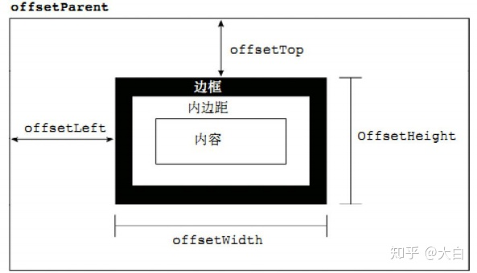
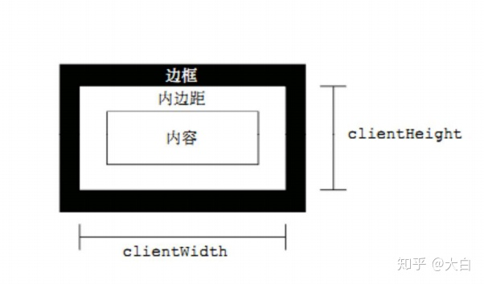
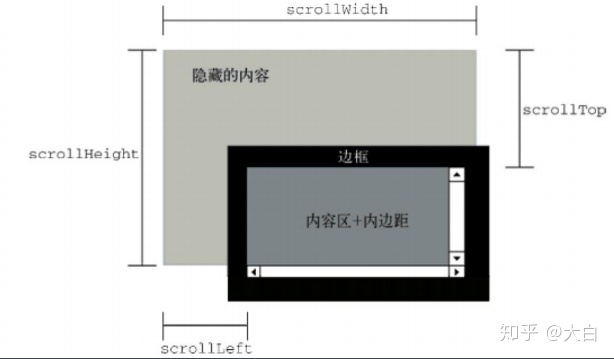
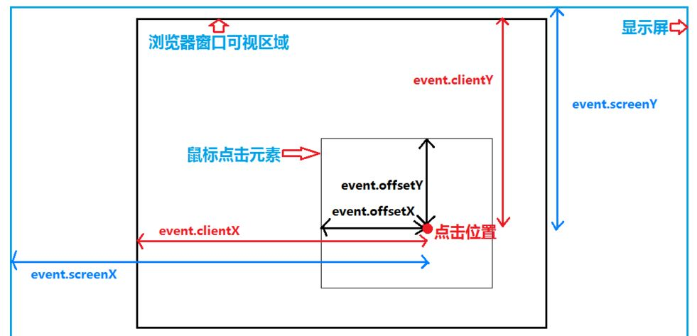
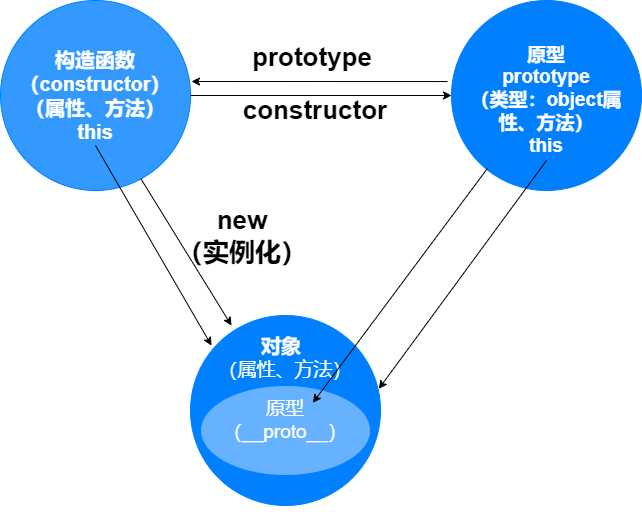

# 基础

### offset

- offsetParent：定位父级
  1. 元素自身有 fixed 定位，offsetParent 的结果为 null
  2. 元素自身无 fixed 定位，且父元素都没有设置定位，offsetParent 的结果为 body
  3. 元素自身无 fixed 定位，且父级元素存在经过定位的元素，offsetParent 的结果为离自身元素最近的经过定位的父级元素
  4. \<body\>元素的 offsetParent 是 null
- offsetWidth：元素在水平方向上占用的空间大小，无单位(以像素 px 计)，offsetWidth = border-left-width + padding-left + width + padding-right + border-right-width;
- offsetHeight：offsetHeight 表示元素在垂直方向上占用的空间大小，无单位(以像素 px 计)，offsetHeight = border-top-width + padding-top + height + padding-bottom + border-bottom-width
- offsetTop：表示元素的上外边框至 offsetParent 元素的上内边框之间的像素距离
- offsetLeft：表示元素的左外边框至 offsetParent 元素的左内边框之间的像素距离
  ### client
  
- clientWidth：表示元素节点的客户区宽度，clientWidth = padding-left + width + padding-right
- clientHeight：表示元素节点的客户区高度，clientHeight = padding-top + height + padding-bottom
- clientLeft：表示左边框的宽度
- clientTop：表示上边框的宽度

  1. 所有的 client 属性都是只读的
  2. 如果给元素设置了 display:none，则客户区 client 属性都为 0
  3. 每次访问客户区 client 属性都需要重新计算，重复访问需要耗费大量的性能，所以要尽量避免重复访问这些属性。如果需要重复访问，则把它们的值保存在变量中，以提高性能

  ### scroll

  

- scrollWidth：元素的总宽度，包括由于溢出而无法展示在网页的不可见部分
- scrollHeight：元素的总高度，包括由于溢出而无法展示在网页的不可见部分
  1. 没有滚动条时，scrollHeight 与 clientHeight 属性结果相等，scrollWidth 与 clientWidth 属性结果相等
  2. 存在滚动条时，但元素设置宽高大于等于元素内容宽高时，scroll 和 client 属性的结果相等
- scrollTop：表示被隐藏在内容区域上方的像素数。元素未滚动时，scrollTop 的值为 0，如果元素被垂直滚动了，scrollTop 的值大于 0，表示元素上方不可见内容的像素高度
- scrollLeft：表示被隐藏在内容区域左侧的像素数。元素未滚动时，scrollLeft 的值为 0，如果元素被水平滚动了，scrollLeft 的值大于 0，且表示元素左侧不可见内容的像素宽度
  1. 当滚动条滚动到内容底部时，符合以下等式：scrollHeight = scrollTop + clientHight
  2. 与 scrollHeight 和 scrollWidth 属性不同的是，scrollLeft 和 scrollTop 是可写的
  3. 大部分的浏览器通过 document.documentElement.scrollTop 和 scrollLeft 可以反映和控制页面的滚动；safari 浏览器是通过 document.body.scrollTop 和 scrollLeft 来控制的
  4. 页面的滚动高度兼容写法：docScrollTop = document.documentElement.scrollTop || document.body.scrollTop
  5. 回到顶部： document.documentElement.scrollTop = document.body.scrollTop = 0;
- scrollTo(x,y)：当前 window 中显示的文档，让文档中由坐标 x 和 y 指定的点位于显示区域的左上角

### MouseEvent

- altkey：触发鼠标事件时是否 alt 按键被按下,如果按下，则返回 true，否则返回 fasle
- button：事件属性返回一个阿拉伯数字 ， 0 代表 按下 左键 ，1 代表按下 滚轮 ，2 代表按下 右键
- offsetX、offsetY：事件属性返回触发事件时 鼠标相对于事件源元素 的 X,Y 坐标，标准事件没有对应的属性
- clientX、clientY：事件属性返回当事件被触发时鼠标指针相对于浏览器页面（或客户区）的水平坐标、垂直坐标
- pageX、pageY：事件属性返回当事件被触发时鼠标指针相对于整个页面左上角的水平坐标、垂直坐标
- screenX、screenY：事件属性返回当事件被触发时鼠标位置相对于用户屏幕水水平坐标、垂直坐标，此时的参照点也就是原点是屏幕的左上角

### prototype 和\_\_proto\_\_关系？

所有对象都有\_\_proto\_\_属性，函数这个特殊对象除了具有\_\_proto\_\_属性，还特有的原型属性 prototype。prototype 对象默认有 2 个属性，constructor 属性和\_\_proto\_\_属性。prototype 属性可以给函数和对象添加可共享的（继承）的方法、属性，而\_\_proto\_\_是查找某函数或对象的原型链方式。constructor 这个属性包含了一个指针，指回原构造函数。

