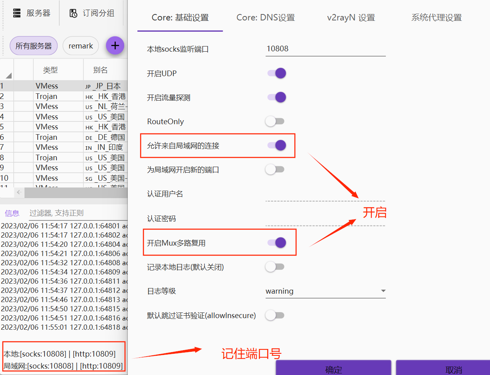
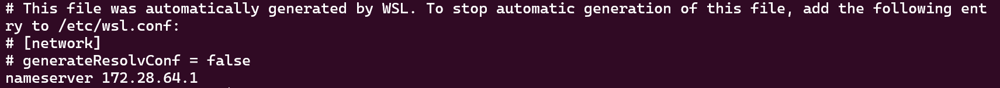

### 免费代理软件

- windows：[v2rayN](https://github.com/2dust/v2rayN)
- Mac：[V2rayU](https://github.com/yanue/V2rayU/)
- Android: [v2rayNG](https://github.com/2dust/v2rayNG)
- [免费节点](https://nodefree.org/)

### 终端下设置代理

- 临时更改代理

```bash
# cmd命令行
set http_proxy=http://127.0.0.1:10809
set https_proxy=http://127.0.0.1:10809
# 取消
set http_proxy=
set https_proxy=

# PowerShell命令行
$env:http_proxy="http://127.0.0.1:10809"
$env:https_proxy="http://127.0.0.1:10809"
# 取消
$env:http_proxy=""
$env:https_proxy=""

# linux下
export http_proxy=http://127.0.0.1:10809
export https_proxy=http://127.0.0.1:10809
# 取消
export http_proxy=
export https_proxy=
```

- 永久有效，把配置放到环境变量中

  - windows 放置到系统环境变量中，变量名分别为 `http_proxy`、`https_proxy`，值为 `http://127.0.0.1:10809`
  - linux 下，写入用户的 shell profile 如果使用的是 bash，写入~/.bashrc，如果是 zsh，写入~/.zshrc 如果不确定，就直接写入~/.bashrc 后，还行 source 命令，让配置生效
    ```bash
    export http_proxy=http://127.0.0.1:10809
    export https_proxy=http://127.0.0.1:10809
    ```

> :warning: 配置中的端口号 10809 根据 v2rayN 中的配置，可能会发生变化

### 配置 WSL2 使用本机 V2rayN 代理

1. 打开 v2rayN 的配置

- 勾选允许来自局域网的连接，
- 勾选开启 Mux 多路复用
- 记住局域网端口号
  

2.  Windows 去访问 WSL2 可以直接通过 localhost 访问的，但是 WSL2 去访问 windows 就不能再用 localhost 了，而 WSL2 在 windows 中是被单独的分配了一个 IP。 想查 windows 当中 WSL2 的 IP，只需要通过下方这条命令来获取 WSL2 的地址即可。在 WSL2 中敲入下面命令

    ```bash
    cat /etc/resolv.conf
    ```

    得到如下图所示结果：

    

3.  每次启动 WSL2 会重新分配 IP，需要写到环境变量`~/.bashrc`中新增如下命令
    ```bash
    export windows_host=`cat /etc/resolv.conf|grep nameserver|awk '{print $2}'`
    # 此处的端口号就是第一步中的局域网http端口号
    export ALL_PROXY=http://$windows_host:10809
    export HTTP_PROXY=$ALL_PROXY
    export http_proxy=$ALL_PROXY
    export HTTPS_PROXY=$ALL_PROXY
    export https_proxy=$ALL_PROXY
    ```
4.  执行`source ~/.bashrc`让配置立马生效
5.  执行`curl -vv www.google.com`看下代理是否生效

    > :warning:没有开启 v2rayN 时候需要关闭代理才能正常访问网络
